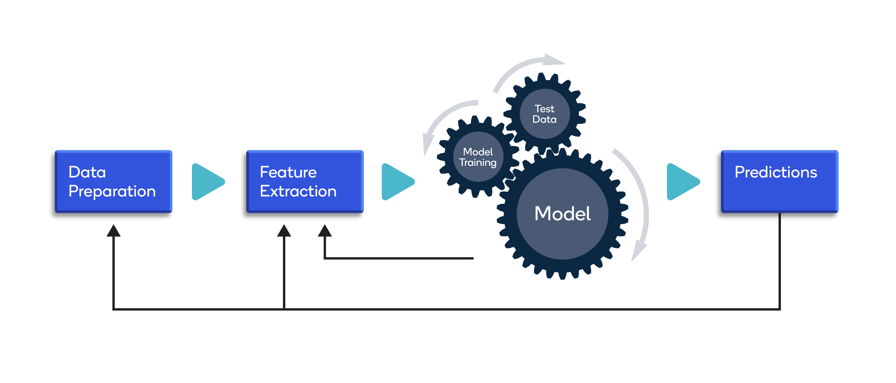

# Final Machine Learning Project 

Our Final project was aimed at making price predictions for stocks ranging from 5 days into the future to 1 month as well as 1 year predictions. The model we had most success with can be found in the "Random Forest Modelling" file. The PDF gives more precise background information about our project goals.

## Further Works Folder

Apart from working with Yahoo Finance I have also worked with the Pima Diabetes for Classifiaction as well as the Wine Quality Dataset for Regression. With both of these data sets I have worked with RF models / Decision Trees, Gradient Boosting, Ada Boosting and Neural Networks. 

